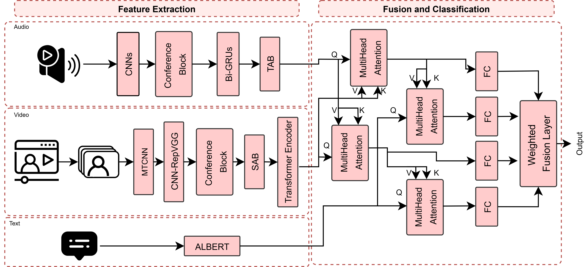
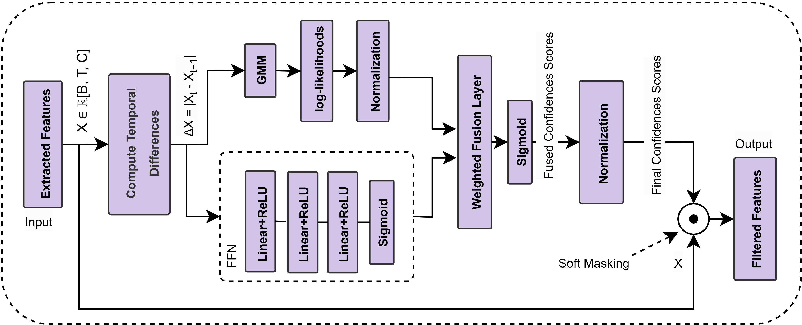
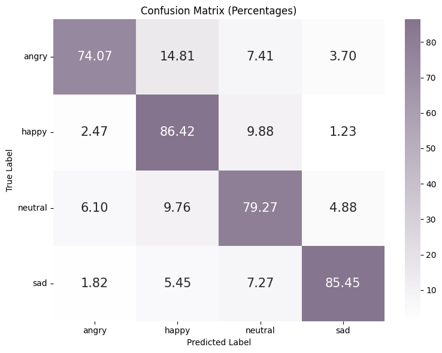

<!-- PROJECT LOGO -->
<br />
<div id="readme-top" align="center">
  <a href="https://github.com/InesJemmali/Hybrid-Confidence-Guided-Feature-Selection-for-Enhanced-Multimodal-Emotion-Recognition">
    
  </a>

  # AV-CARE: Hybrid Confidence-Guided Feature Selection for Multimodal Emotion Recognition

  <p align="center">
    Official implementation of the paper:
    <br />
    <strong>"Hybrid Confidence-Guided Feature Selection for Enhanced Multimodal Emotion Recognition"</strong>
    <br />
  </p>
</div>

<div align="center">

[](https://github.com/InesJemmali/Hybrid-Confidence-Guided-Feature-Selection-for-Enhanced-Multimodal-Emotion-Recognition/#readme "Go to project documentation")

</div>  

<div align="center">
    <p align="center">
    ·
    <a href="https://github.com/InesJemmali/Hybrid-Confidence-Guided-Feature-Selection-for-Enhanced-Multimodal-Emotion-Recognition/issues">Report Bug</a>
    ·
    <a href="https://github.com/InesJemmali/Hybrid-Confidence-Guided-Feature-Selection-for-Enhanced-Multimodal-Emotion-Recognition/issues">Request Feature</a>
  </p>
</div>

---

## Overview
Key contributions:
- **Hybrid confidence estimation:** Combines supervised FFN and unsupervised GMM for robust feature filtering.
- **Early noise mitigation:** Confidence scores reweight features before temporal modeling.
- **Hierarchical fusion:** Two-stage cross-attention: audio-visual alignment followed by text-guided refinement.
- **Composite loss:** Combines focal loss with a confidence-alignment term to guide reliable feature weighting.
- **State-of-the-art results:** High accuracy and competitive F1-score on IEMOCAP.


---

## Contents
<details>
  <summary>Table of Contents</summary>
  <ol>
    <li><a href="#abstract">Abstract</a></li>
    <li><a href="#built-with">Built With</a></li>
    <li><a href="#datasets">Dataset</a></li>
    <li><a href="#evaluation-metrics">Evaluation Metrics</a></li>
    <li><a href="#experimental-results">Experimental Results</a></li>
    <li><a href="#comparison-with-state-of-the-art">Comparison with State-of-the-Art</a></li>
    <li><a href="#installation">Installation</a></li>
    <li><a href="#usage">Usage</a></li>
    <li><a href="#project-structure">Project Structure</a></li>
    <li><a href="#paper-reference">Paper Reference</a></li>
    <li><a href="#license">License</a></li>
    <li><a href="#contact">Contact</a></li>
  </ol>
</details>

---

## Abstract

## Abstract
Multimodal emotion recognition (MMER) integrates audio, video, and text to enhance emotion classification in noisy, real-world conditions. We introduce **AV-CARE**, a hybrid confidence-guided framework that computes frame-level and channel-level confidence scores for audio and visual features using two complementary mechanisms:
- **Supervised FFN** for local, short-term emotional salience.
- **Unsupervised GMM** for global statistical regularities.

These confidence scores are fused and applied before temporal modeling, enabling selective attenuation of noisy inputs while emphasizing salient patterns. A hierarchical cross-modal attention mechanism then integrates these filtered features with text for final classification. Evaluations on the IEMOCAP dataset show that AV-CARE achieves **90.81% accuracy** and **81.69% F1-score**, outperforming several competitive baselines.


## Model Architecture

### Audio Modality
- **Input:** Raw waveforms.
- **Feature Extraction:** 1D CNN with large initial receptive fields followed by smaller convolutional layers.
- **Temporal Modeling:** 4-layer BiGRU to capture bidirectional dependencies.
- **Temporal Attention Block (TAB):** Highlights emotion-relevant frames.

### Video Modality
- **Preprocessing:** MTCNN for face detection and alignment.
- **Spatial Encoding:** RepVGG-based CNN for efficient feature extraction.
- **Spatial Attention Block (SAB):** Enhances discriminative regions in facial expressions.
- **Temporal Modeling:** Transformer encoder for long-range temporal dependencies.

### Text Modality
- **Encoder:** Pre-trained ALBERT model.
- **Representation:** Extracts CLS token embedding to capture semantic context.

### Confidence-Guided Feature Selection
- **FFN (Local Confidence):** Learns short-term temporal changes in features.
- **GMM (Global Confidence):** Models distributional patterns for robust scoring.
- **Fusion:** Learnable fusion layer merges FFN and GMM scores into per-frame, per-channel soft masks.

### Fusion Strategy
1. **Audio-Visual Cross-Attention:** Aligns speech prosody and facial expressions.
2. **Text-Guided Fusion:** Text queries refine audio-visual context.
3. **Weighted Decision Fusion:** Learns optimal contribution of each fusion path for final classification.

### Loss Function
- **Focal Loss:** Focuses training on hard-to-classify samples.
- **Confidence Alignment Loss:** Penalizes overconfident predictions in misclassified regions.


<p align="right">(<a href="#readme-top">back to top</a>)</p>

---

## Built With

### Tools and Libraries

- 
- 
- 
- 
- 
- 

<p align="right">(<a href="#readme-top">back to top</a>)</p>

---

## Architecture of the Model: AV-CARE

<p align="center">
  
</p>

<p align="right">(<a href="#readme-top">back to top</a>)</p>

## Architecture of the confidence-guided filtering module

<p align="center">
  
</p>

<p align="right">(<a href="#readme-top">back to top</a>)</p>

---

## Datasets

The model is evaluated on the **IEMOCAP** dataset:
   - 12 hours of audiovisual data.
   - 4 emotion classes: Angry, Happy, Neutral, Sad.
   - Data split: 80% train, 10% validation, 10% test.

| Emotion | Count |
|---------|--------|
| Neutral | 1,708  |
| Happy   | 1,636  |
| Angry   | 1,103  |
| Sad     | 1,084  |


Processed data for dataset can be downloaded from:
[Download Processed Data](https://hkustconnect-my.sharepoint.com/personal/wdaiai_connect_ust_hk/_layouts/15/onedrive.aspx?id=%2Fpersonal%2Fwdaiai_connect_ust_hk%2FDocuments%2FMME2E%2Fdata%2Ezip&parent=%2Fpersonal%2Fwdaiai_connect_ust_hk%2FDocuments%2FMME2E&ga=1)

Additionally, the repository includes Jupyter notebooks for data preparation and pre-processing. These notebooks handle the necessary steps to transform the dataset into its final format for training, validation, and testing.

<p align="right">(<a href="#readme-top">back to top</a>)</p>

---

## Evaluation Metrics

Performance is assessed using:
  - **Accuracy** for overall correctness
  - **F1-score** for balanced evaluation across emotion classes


---

## Experimental Results


**Table 1:** Performance on IEMOCAP (Accuracy, Precision, Recall, F1-score)  


| Emotion | Accuracy | Precision | Recall | F1-score |
|---------|----------|-----------|--------|----------|
| Angry   | 91.91%   | 83.33%    | 74.07% | 78.43%   |
| Happy   | 88.97%   | 78.65%    | 86.42% | 82.35%   |
| Neutral | 87.87%   | 80.25%    | 79.27% | 79.75%   |
| Sad     | 94.49%   | 87.04%    | 85.45% | 86.24%   |
| **Avg** | **90.81%** | **82.32%** | **81.30%** | **81.69%** |


#### Confusion Matrix

<p align="center">
  
</p>

<p align="right">(<a href="#readme-top">back to top</a>)</p>


---

## Comparison with State-of-the-Art


**Table 2:** Comparison with SOTA Methods on IEMOCAP  

| Method                | Accuracy  | Precision | Recall | F1-score  |
| --------------------- | --------- | --------- | ------ | --------- |
| M3ER (2020)            | 82.7      | NA        | NA     | 82.4      |
| NORM-TR (2022)       | 84.3      | NA        | NA     | 84.5      |
| LMR-CBT (2023)        | 82.73     | NA        | NA     | 81.48     |
| Babaali et al. (2023)  | 75.42     | 76.1      | 75.42  | 75.35     |
| Hosseini et al. (2024) | 82.9      | NA        | NA     | NA        |
| Majumder et al. (2018) | 76.5      | NA        | NA     | 76.8      |
| **CAFES (Ours)**      | **90.81** | 82.32     | 81.30  | **81.69** |


---


### Ablation Study

**Table 3:** Ablation Results on IEMOCAP  

| Method      | Accuracy | F1-score |
|-------------|----------|----------|
| No-Conf     | 86.40    | 73.13    |
| GMM-Only    | 87.32    | 75.09    |
| FFN-Only    | 88.42    | 76.88    |
| FFN+GMM     | **90.81** | **81.69** |


<p align="right">(<a href="#readme-top">back to top</a>)</p>

---

## Installation

1. **Clone** this repo:
   ```bash
   git clone https://github.com/InesJemmali/Hybrid-Confidence-Guided-Feature-Selection-for-Enhanced-Multimodal-Emotion-Recognition.git
   cd Hybrid-Confidence-Guided-Feature-Selection-for-Enhanced-Multimodal-Emotion-Recognition
   ```
2. **Install dependencies**:
   ```bash
   pip install -r requirements.txt
   ```

<p align="right">(<a href="#readme-top">back to top</a>)</p>

---

## Usage

1. **Configure dataset paths** in `main.py`.
2. **Train the model**:
   ```bash
   python main.py
   ```
3. **Evaluate on test set**:
   ```bash
   python main.py --test
   ```

<p align="right">(<a href="#readme-top">back to top</a>)</p>

---

## Project Structure

```
/
├── figures/                  # Visualization assets
│   ├── logo.png
│   ├── confusionmatrix.png
│   ├── confedencemodule.png
│   └── model.png
├── AV-CARE/                      # Source code directory
│   ├── models/
│   │   ├── audio_model.py
│   │   ├── text_model.py
│   │   ├── video_model.py
│   │   ├── gmm.py
│   │   ├── confidences.py
│   │   ├── transformers_module.py
│   │   ├── mmer.py
│   │   └── attention_module.py
│   ├── trainers/
│   │   └── trainer_definitions.py
│   ├── utils/
│   │   ├── data_utils.py
│   │   ├── evaluations.py
│       └── loss_functions.py
├── notebooks/
│   ├── datasetiemocap.ipynb
│   ├── datasetmosei.ipynb
├── .gitignore               # Git ignore file
├── LICENSE
├── main.py                  # Main entry point
├── README.md
└── requirements.txt         # Dependencies
```

<p align="right">(<a href="#readme-top">back to top</a>)</p>

---

## Paper Reference

If you utilize this code, please cite:

> "Hybrid Confidence-Guided Feature Selection for Multimodal Emotion Recognition"

<p align="right">(<a href="#readme-top">back to top</a>)</p>

---

## Steps to train the Model

1. **Install Git** (if not already installed).
2. **Clone the Repository**:
   ```bash
   git clone https://github.com/InesJemmali/Hybrid-Confidence-Guided-Feature-Selection-for-Enhanced-Multimodal-Emotion-Recognition.git
   cd Hybrid-Confidence-Guided-Feature-Selection-for-Enhanced-Multimodal-Emotion-Recognition
   ```
3. **Ensure Python is Installed**:
   - Check Python version (3.7 recommended):
     ```bash
     python --version
     ```
4. **Install Required Libraries**:
   ```bash
   pip install -r requirements.txt
   ```
5. **Ensure all Paths is Correct**:
  
6. **Run the Main Script**:
   ```bash
   python main.py
   ```

<p align="right">(<a href="#readme-top">back to top</a>)</p>

---

<!-- CONTRIBUTING -->
## Contributing

We deeply appreciate any contributions that help improve this project.  The open-source community thrives on collaboration, and your input is invaluable.

To contribute, please fork the repository and submit a pull request with your suggested changes.  Alternatively, you can open an issue with the **enhancement** tag to share your ideas.  
We also appreciate you starring the project! Thank you for your support.

1. Fork the Project
2. Create your Feature Branch (`git checkout -b feature/AmazingFeature`)
3. Commit your Changes (`git commit -m 'Add some AmazingFeature'`)
4. Push to the Branch (`git push origin feature/AmazingFeature`)
5. Open a Pull Request

<p align="right">(<a href="#readme-top">back to top</a>)</p>


---

<!-- LICENSE -->
## License

All source code is made available under a [BSD 3-Clause License](https://opensource.org/license/bsd-3-clause) license. You can freely
use and modify the code, without warranty, so long as you provide attribution
to the authors. See `LICENSE.md` for the full license text.

<p align="right">(<a href="#readme-top">back to top</a>)</p>

## Contact

Ines Jemmali - [@LinkedIn](www.linkedin.com/in/ines-jemmali-8b1a92223) - ines.jemmali@mail.concordia.ca
Alaa Nfissi  - [@LinkedIn](https://www.linkedin.com/in/alaa-nfissi) -  alaa.nfissi@mail.concordia.ca

<p align="right">(<a href="#readme-top">back to top</a>)</p>


